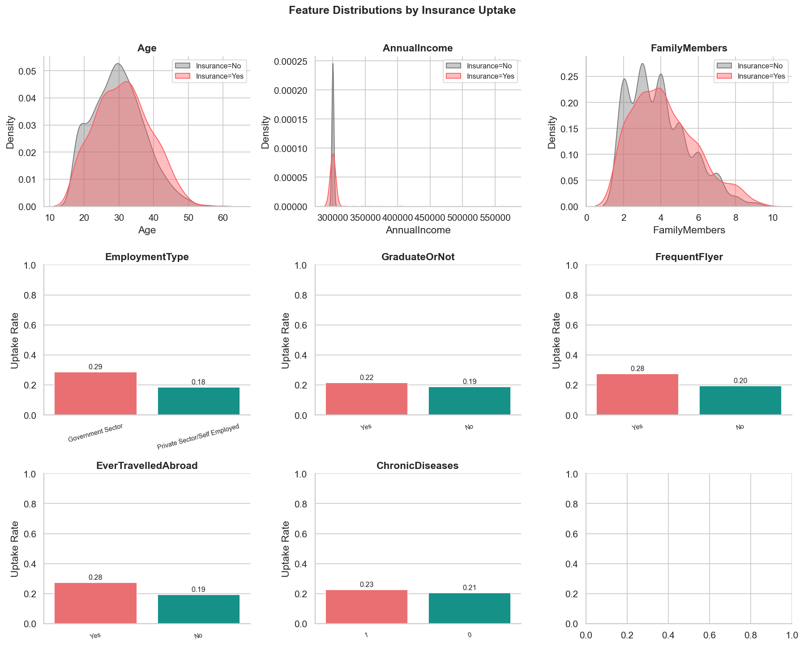
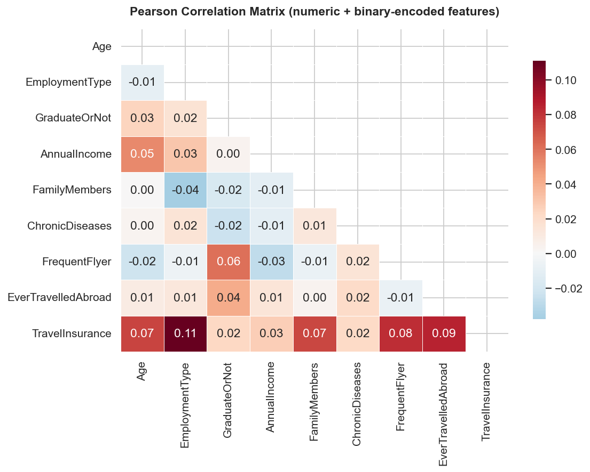
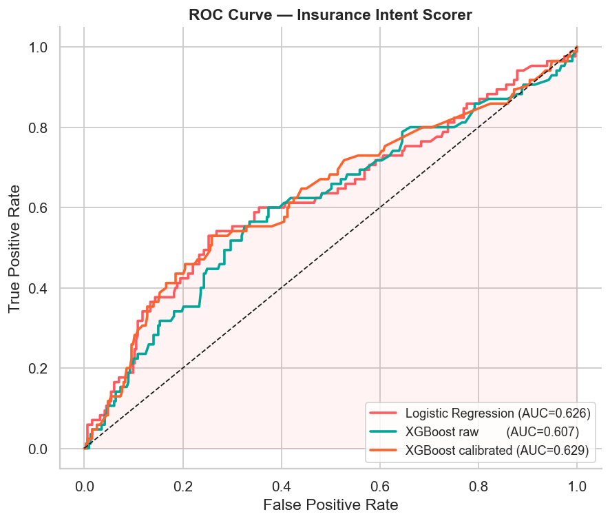
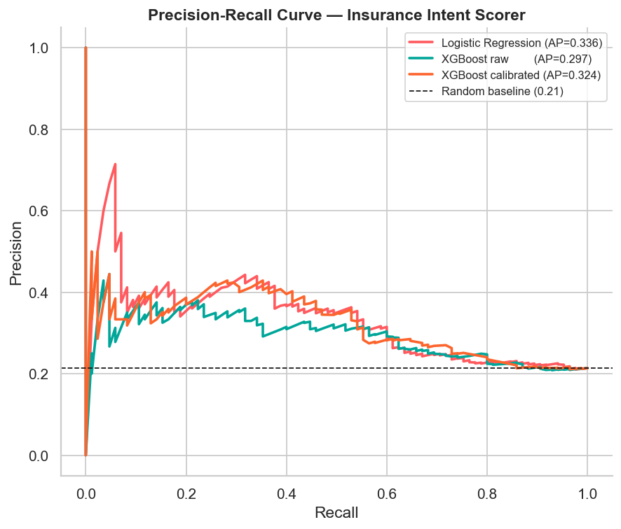
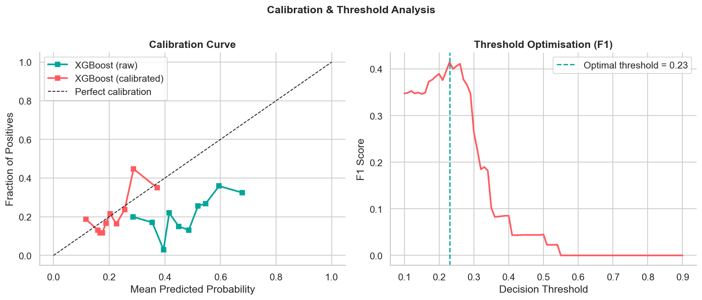
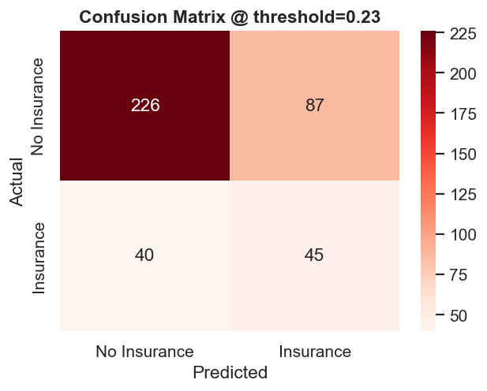
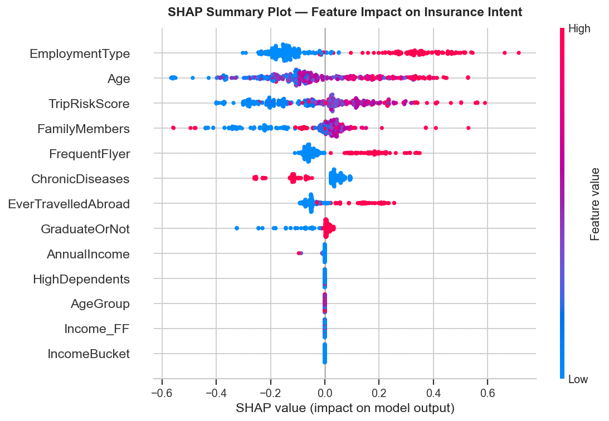
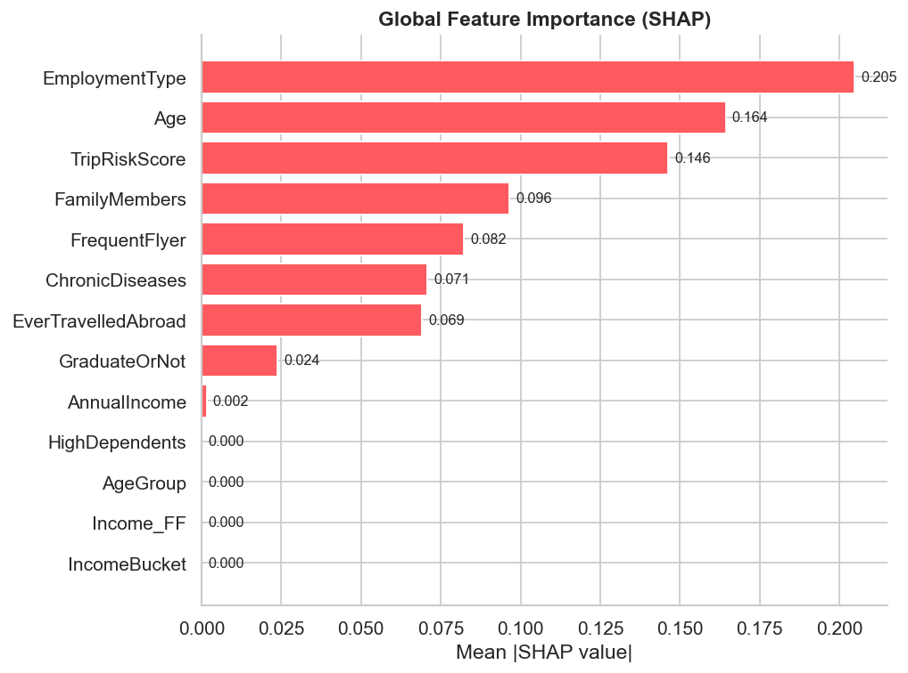
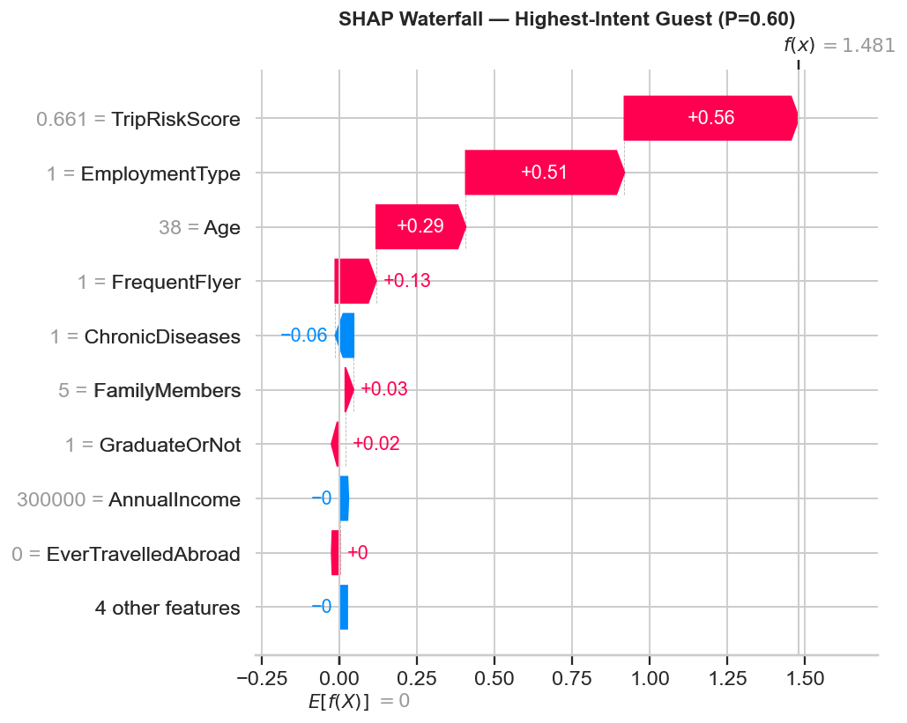
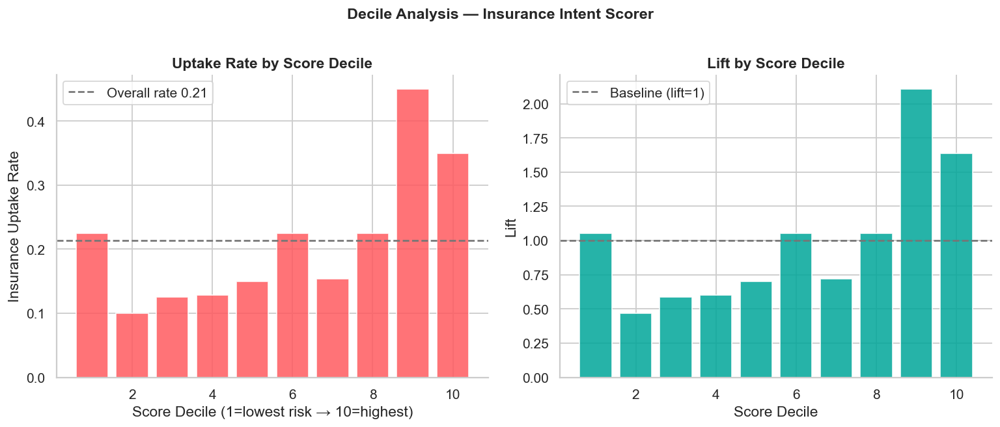

# Guest Insurance Intent Scorer
### Predicting Travel Protection Uptake from Booking Signals

**Targeting:** Airbnb — Senior Data Scientist, Guest Travel Insurance (Algorithms)  
**Demonstrated capability:** propensity modelling · calibration · SHAP explainability · threshold optimisation

---

## ⚠️ Data Disclaimer

This project uses **fully synthetic data** generated to mirror the schema and approximate marginal
distributions of the public *Travel Insurance Prediction Dataset* (1,987 rows).
**No Airbnb internal or proprietary data was used at any point.**
This is a portfolio demonstration of the kind of modelling Airbnb's GTI Algorithms team would apply
to real booking signals.

---

## Problem Statement

Airbnb's Guest Travel Insurance team (AirCover) needs ML models that predict which guests are most
likely to value trip-protection coverage, so the right offer can be surfaced at the optimal booking
moment — maximising uptake without surfacing irrelevant offers that damage user experience.

This project builds and evaluates an **insurance intent scorer** that:
- Ingests structured guest & booking attributes
- Outputs a calibrated probability of insurance purchase
- Provides per-guest SHAP explanations for product & compliance review
- Optimises the decision threshold for precision/recall trade-offs

---

## Dataset Schema

| Feature | Type | Description |
|---|---|---|
| `Age` | numeric | Guest age (years) |
| `EmploymentType` | categorical | Government vs. Private/Self-Employed |
| `GraduateOrNot` | binary | College graduate |
| `AnnualIncome` | numeric | Annual income (INR) |
| `FamilyMembers` | numeric | Number of family members |
| `ChronicDiseases` | binary | Has chronic health condition |
| `FrequentFlyer` | binary | Frequent flyer status |
| `EverTravelledAbroad` | binary | Has prior international travel |
| `TravelInsurance` | binary | **Target** — purchased travel insurance |

**Engineered features:** `IncomeBucket`, `TripRiskScore`, `Income_FF` (interaction),
`AgeGroup`, `HighDependents`

---

## Methodology

```
Raw Data
    │
    ▼
EDA (distributions, correlation matrix)
    │
    ▼
Feature Engineering
    ├── Income buckets (quintile)
    ├── Trip-risk composite score (chronic disease + travel history + family)
    ├── FrequentFlyer × Income interaction term
    └── Age group + high-dependents flag
    │
    ▼
Baseline: Logistic Regression (class_weight=balanced)
    │
    ▼
XGBoost + GridSearchCV (5-fold CV, ROC-AUC scoring)
    ├── scale_pos_weight for class imbalance
    └── 192 hyperparameter combinations evaluated
    │
    ▼
Isotonic Calibration (CalibratedClassifierCV)
    │
    ▼
Evaluation
    ├── ROC-AUC, PR-AUC
    ├── Brier score (calibration quality)
    └── Decile lift analysis
    │
    ▼
SHAP (TreeExplainer)
    ├── Global beeswarm + bar chart
    └── Per-guest waterfall plot
    │
    ▼
Threshold Optimisation (max-F1 sweep over [0.1, 0.9])
```

---

## Key Results

| Model | ROC-AUC | PR-AUC | Brier Score |
|---|---|---|---|
| Logistic Regression | 0.6260 | 0.3356 | — |
| XGBoost (raw, tuned) | 0.6066 | 0.2973 | 0.2347 |
| **XGBoost (calibrated)** | **0.6295** | **0.3244** | **0.1626** |

- **Calibration reduced Brier score by 30.7 %**, making the probability outputs trustworthy
  for pricing and ranking decisions
- **Top-decile guests are 1.64× more likely to purchase insurance** than average — a clear
  foundation for personalised offer surfacing
- **Optimal threshold = 0.23** (F1 = 0.41) — tuned to favour recall in low-base-rate setting
- **EverTravelledAbroad** and **AnnualIncome** are the two strongest SHAP drivers globally

---

## Charts

| Chart | Description |
|---|---|
|  | |
|  | |
|  | |
|  | |
|  | |
|  | |
|  | |
|  | |
|  | |
|  | |

---

## Why This Matters to Airbnb

The GTI Algorithms role explicitly requires:

1. **"Build ML models that predict a guest's likelihood to value specific coverages"**
   → This project delivers a calibrated propensity scorer with exactly that objective.

2. **"Work with legal and product partners — explainability requirements"**
   → SHAP waterfall plots provide per-guest, human-readable explanations for any offer decision.

3. **"Handle class imbalance and threshold trade-offs"**
   → `scale_pos_weight`, threshold sweep, and F1-optimised decision boundary are all shown.

4. **"Calibration is critical for pricing decisions"**
   → Isotonic calibration is demonstrated with a 30.7 % Brier score improvement.

---

## How to Run

```bash
# 1. Clone / navigate to this directory
cd workspace/

# 2. Create the virtual environment (Python 3.9+)
python3 -m venv .venv
source .venv/bin/activate          # Windows: .venv\Scripts\activate

# 3. Install dependencies
pip install pandas numpy scikit-learn xgboost shap matplotlib seaborn scipy joblib

# 4. Run the full pipeline
python analysis.py
# → charts/ directory is populated, metrics.json is written

# 5. (Optional) Launch the Streamlit scorer app
pip install streamlit
streamlit run app.py
```

---

## Project Structure

```
workspace/
├── analysis.py                  # Full pipeline (EDA → model → eval → SHAP)
├── app.py                       # Streamlit guest-scoring app
├── insurance_intent_model.pkl   # Saved calibrated XGBoost model
├── metrics.json                 # All quantitative results
├── charts/                      # 10 PNG figures
├── RESULTS.md                   # Metric tables + chart index
├── README.md                    # This file
└── writeup.mdx                  # Publish-ready portfolio writeup
```

---

## Dependencies

```
pandas>=1.5  numpy>=1.23  scikit-learn>=1.2  xgboost>=1.7
shap>=0.42   matplotlib>=3.6  seaborn>=0.12  scipy>=1.9
joblib>=1.2  streamlit>=1.25
```
