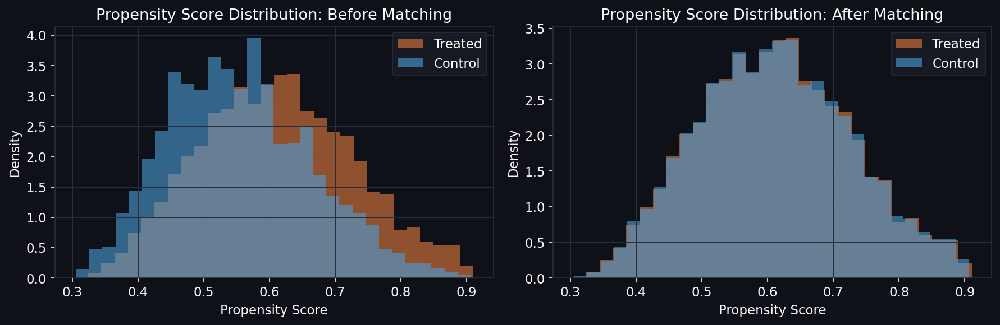
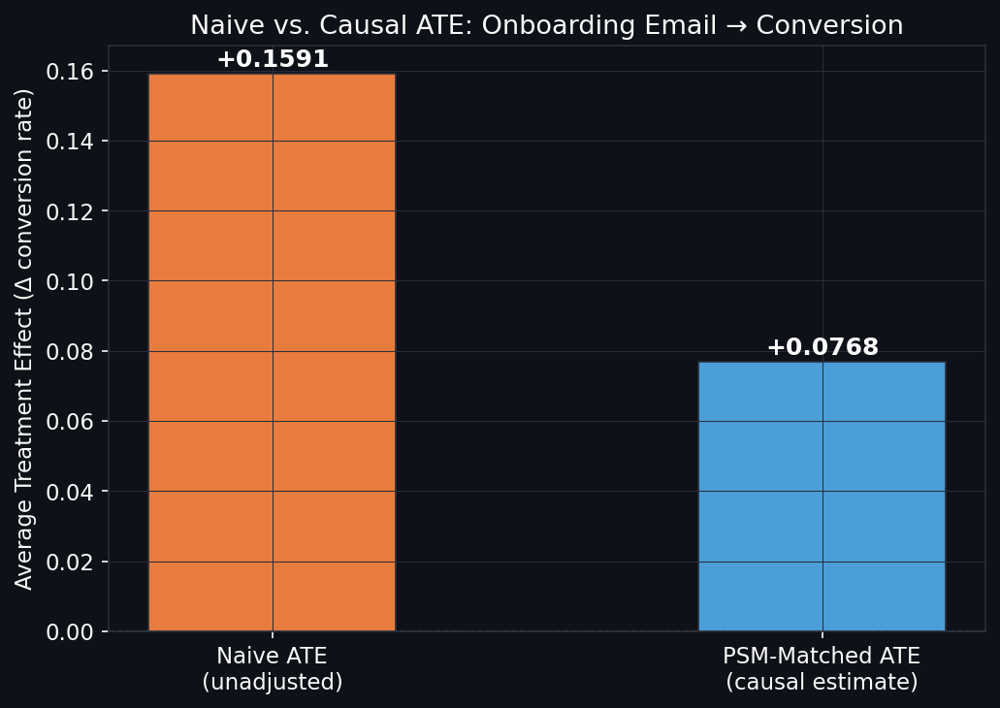
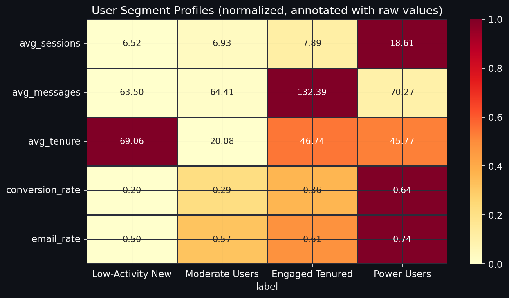
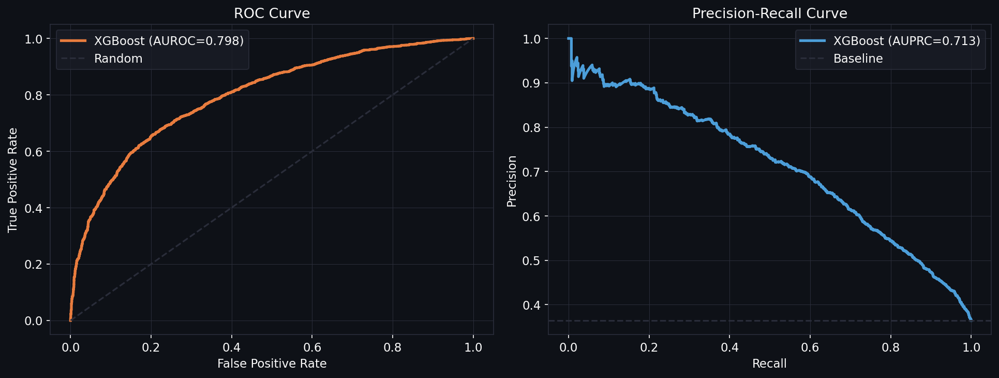
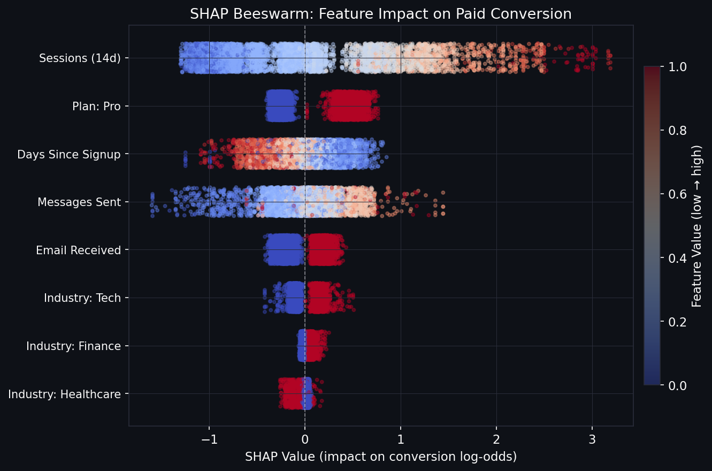
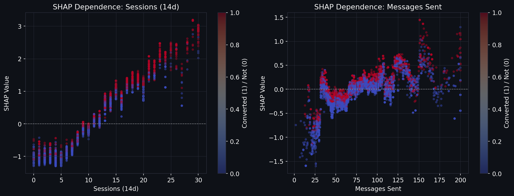
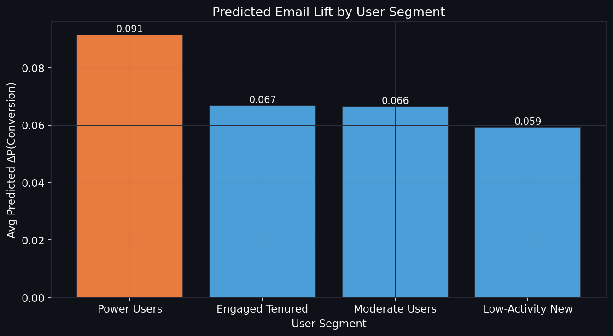

## What I Built and Why

When a marketing team reports that users who got the onboarding email converted at
higher rates, there's an obvious confound: the email probably went to users who were
already more engaged. The raw difference is measuring that pre-existing advantage as
much as the email's effect.

This project builds the full pipeline for correcting that. It's framed around a
synthetic SaaS user lifecycle dataset that models the kind of problem a marketing DS
would face at an AI product company: onboarding emails, feature nudges, conversion
to paid, and the CRM targeting bias that makes naive A/B comparisons misleading.

The dataset is explicitly synthetic and generated in code with a fixed seed. I'm not
claiming this represents any real company's data. But the problem structure maps
directly to real lifecycle work, and the methods apply without modification to real data.

---

## The Confounding Problem

The synthetic data has confounding built in. Email treatment assignment follows this
propensity:

```
logit(P(email)) = -0.5 + 0.08*sessions + 0.004*messages + 0.3*(plan=pro) - ...
```

More active users are more likely to get the email. So the naive conversion gap
between treated and control users mixes two signals: the email's actual effect, and
the fact that active users convert more anyway.

You can see this in the propensity score distributions before matching: treated users
cluster at higher propensity scores. The control group has a different behavioral
profile. Any direct comparison is comparing apples to oranges.



After matching each treated user to their nearest-neighbor control by propensity score,
the sessions imbalance drops from 2.44 to 0.12. Now the groups are comparable.

---

## Causal Estimate vs. Naive Estimate

The headline result:



| Method | ATE |
|---|---|
| Naive (raw difference) | +0.159 |
| PSM-Matched (causal) | +0.077 |

The naive estimate was roughly 2x too large. The true causal lift of the onboarding
email is about 7.7 percentage points, which is still a meaningful effect, but a
campaign decision based on +15.9pp would overinvest in email spend.

---

## User Segmentation

Before modeling lift, I clustered users into behavioral segments using KMeans (k=4)
on sessions, messages, and tenure. The clusters are interpretable:



Four groups fell out cleanly:

- **Low-Activity New** (n=1,566): recent signups with low engagement, 19.8% conversion
- **Moderate Users** (n=1,627): newer users with average activity, 29.3% conversion
- **Engaged Tenured** (n=891): older users with high message volume, 35.6% conversion
- **Power Users** (n=916): high session counts, 63.6% conversion

These segments are the unit of analysis for marketing strategy. Sending the same
onboarding email to all four groups and expecting the same return is a bad bet.

---

## Conversion Prediction (XGBoost)

I trained an XGBoost classifier on the propensity-matched sample. Using the matched
sample rather than the full population keeps the training distribution causally clean:
the model learns from users who are comparable on pre-treatment features.

5-fold cross-validation results:

- AUROC: **0.798**
- AUPRC: **0.713**



AUPRC is the more useful metric here because conversion is imbalanced (33.7% positive).
An AUPRC of 0.713 against a baseline of 0.337 is solid lift over random targeting.

---

## SHAP: What Actually Drives Conversion



Sessions in the last 14 days is the dominant signal by a wide margin (mean |SHAP| = 0.805).
Users with high recent activity convert at much higher rates regardless of whether they
got the email. Pro plan membership is second (0.326), which makes sense as a proxy for
users who've already committed.

The email treatment ranks 5th (0.199). This is consistent with it having a real but
moderate effect: it moves the needle, but behavioral engagement is the stronger predictor.



The sessions dependence plot shows a clear monotonic relationship: every additional
session adds positive SHAP value. There's no obvious threshold effect. Messages sent
shows a similar pattern but flatter at high values.

---

## Segment-Level Lift



The model's counterfactual estimates (P(convert|email=1) - P(convert|email=0)) vary
across segments:

| Segment | Avg Predicted Lift |
|---|---|
| Power Users | +0.092 |
| Engaged Tenured | +0.067 |
| Moderate Users | +0.066 |
| Low-Activity New | +0.059 |

Power Users see the most lift. This might seem counterintuitive since they already
convert at 63.6%, but the model finds the email nudges their probability higher from
an already-high baseline. In practice, you'd want to validate this with a held-out
experiment before acting on it.

---

## Why This Is Relevant to Anthropic's Marketing DS Work

The role asks for experiment design, causal inference studies, and user segmentation
to measure marketing intervention effectiveness. This project runs through exactly
that checklist:

The propensity matching step is the core methodological contribution. Claude's
lifecycle team probably has similar targeting bias in real email sends: users who
get nudges at the right moment may already have been more likely to engage. Separating
causal effect from selection effect is the job.

Segment-level lift estimates matter because growth PMs need to know where to send
the next email campaign, not just whether emails "work" on average. The Streamlit
app makes that interactive without requiring someone to touch code.

SHAP explainability ties the model back to business questions. When a stakeholder
asks "why did this user not convert?", a sorted bar of SHAP values gives a direct
answer that's actually auditable.

The whole stack (synthetic confounded data, propensity estimation, matching, XGBoost,
SHAP, Streamlit) is fully reproducible from one seed. That reproducibility matters
both for trust and for iterating when the experiment design changes.

---

## How to Run

```bash
python3 -m venv .venv && source .venv/bin/activate
pip install pandas numpy scikit-learn xgboost shap matplotlib seaborn streamlit scipy

# Full analysis pipeline
python analysis.py

# Interactive Streamlit app
streamlit run app.py
```
