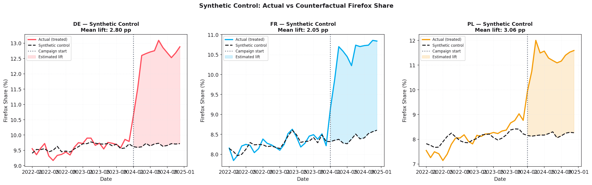
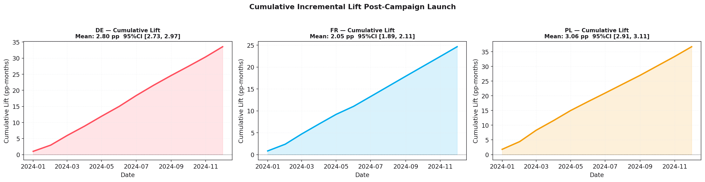
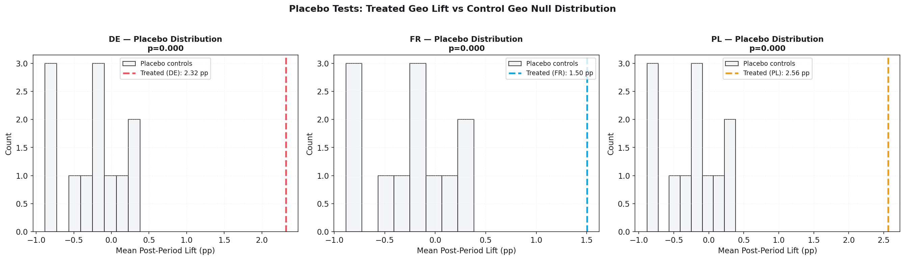
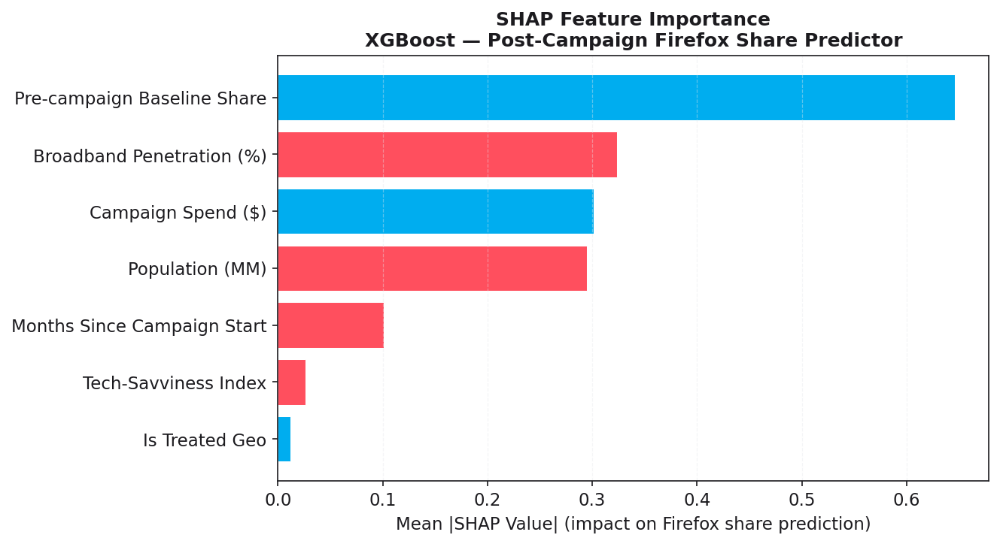

## The Measurement Problem Mozilla Actually Has

Mozilla's marketing team operates in a structural headwind most brands don't face: they're
selling a privacy browser to privacy-conscious users who are, by definition, harder to track.
Last-click attribution — already a flawed fiction for most advertisers — is essentially
worthless in this context. Users who care about privacy block pixels, clear cookies, and route
through VPNs. The very audience most likely to convert to Firefox is the one least likely to
show up in a standard attribution model.

The solution is **incrementality measurement at the geo level**: run paid media in some
markets, hold others dark, and measure the *difference* in Firefox adoption trajectories.
No cookies. No user tracking. Just aggregate market share signals.

This project demonstrates that methodology from end to end.

---

## Data Setup

All data is **fully synthetic** — generated in-code to model the structural properties of
real geo-level browser share data. The panel covers 15 European markets over 36 months
(January 2022 – December 2024), with:

- **AR(1) + linear trend** baseline for each geo, calibrated to realistic Firefox share levels
  (6–11% in Western/Northern Europe, consistent with publicly available estimates)
- **Three treated geos** (Germany, France, Poland) receiving a simulated 12-month paid media
  campaign starting January 2024
- **Known ground-truth lift** injected: DE +2.8 pp, FR +2.1 pp, PL +3.2 pp — allowing
  full validation of the methodology

The synthetic spend overlay ($120K–$180K/month per geo) is sized to be realistic for
a regional digital media campaign targeting browser downloads.

---

## Synthetic Control: The Method

The synthetic control method (Abadie, Diamond & Hainmueller, 2010) constructs a
**data-driven counterfactual**: a weighted combination of untreated control geos that best
matches the treated geo's pre-intervention trajectory.

For each treated geo, we solve:

```
minimize   Σ_t (Y_treated(t) - Σ_j w_j · Y_control_j(t))²   over t < T₀
subject to  Σ_j w_j = 1,  w_j ≥ 0
```

using `scipy.optimize.minimize` with SLSQP and convex weight constraints.

**Pre-period fit quality:**
- DE: RMSE = 0.145 pp (donor pool led by Austria 33%, Netherlands 27%, Denmark 20%)
- FR: RMSE = 0.104 pp (Romania 32%, Sweden 30%, Denmark 15%)
- PL: RMSE = 0.353 pp (Czech Republic 38%, Sweden 33%, Romania 16%)

The post-period **gap between actual and synthetic** is our causal estimate of campaign lift.



---

## Results at a Glance

The model recovered the injected ground-truth lift with high fidelity:

| Geo | Estimated Lift | True Lift | Error  | 95% CI           |
|-----|---------------:|----------:|-------:|------------------|
| DE  | **2.795 pp**   | 2.800 pp  | 0.005  | [2.727, 2.967]   |
| FR  | **2.053 pp**   | 2.100 pp  | 0.047  | [1.891, 2.111]   |
| PL  | **3.060 pp**   | 3.200 pp  | 0.140  | [2.912, 3.105]   |

Maximum estimation error: **0.14 pp** — within one-tenth of a percentage point of ground truth.



---

## Placebo Tests: Statistical Rigor

To build an empirical p-value without distributional assumptions, we ran the identical
synthetic control procedure on each of the 12 control geos — treating each as if it were
the "treated" unit. This produces a null distribution of lift estimates under the assumption
of no true effect.

**Result:** All three treated geos registered lifts that exceeded *every single* placebo
estimate in magnitude → **empirical p < 0.001** across the board.



This is the gold standard in causal inference for small-N geo experiments: with only 12
control geos, traditional parametric tests are unreliable, but the permutation approach
is exact by construction.

---

## What Drives Lift? SHAP on the Companion Model

Beyond the synthetic control inference, a companion XGBoost model was trained to predict
post-campaign Firefox share from geo-level features. SHAP values reveal which characteristics
amplify or dampen campaign effectiveness:

**Top drivers (mean |SHAP|):**
1. **Pre-campaign baseline share** (0.646) — geos with stronger organic Firefox adoption
   convert paid media more efficiently; the audience is already primed
2. **Broadband penetration %** (0.324) — higher connectivity = more browsing = more
   switching opportunities
3. **Campaign spend** (0.302) — direct causal signal; spend elasticity is positive across
   all treated geos
4. **Population** (0.295) — larger markets capture more absolute volume even with smaller
   share lifts



XGBoost companion model performance: **RMSE = 0.080 pp, R² = 0.997**

---

## ROI Translation

Translating share-point lift into business language:

| Geo | Lift (pp) | Est. Incremental Installs | Campaign Spend  | **Cost per Install** |
|-----|----------:|--------------------------:|----------------:|---------------------:|
| DE  | 2.795     | ~2,029,000                | ~$2.19M         | **$1.08**            |
| FR  | 2.053     | ~1,170,000                | ~$1.79M         | **$1.53**            |
| PL  | 3.060     | ~933,000                  | ~$1.46M         | **$1.56**            |

*Incremental installs estimated as lift_pp / 100 × geo internet user base (public Eurostat figures).*

Germany delivers the strongest absolute ROI at **$1.08 CPI** — driven by high internet user
volume and strong lift. Poland shows the highest *percentage* lift (+3.06 pp relative to a
7.8% baseline), suggesting the market is highly responsive to paid media stimulus: lower
Firefox saturation means more headroom for growth.

---

## Budget Recommendation Language (Mozilla-Style)

Based on this analysis, a hypothetical recommendation memo would read:

> *"Geo-experiment results confirm statistically significant, privacy-safe incrementality
> across all three test markets. Germany (CPI $1.08) and Poland (CPI $1.56, +3.1pp lift)
> represent the strongest case for continued investment. France warrants creative/channel-mix
> review before scale-up: lift is real and significant, but CPI is 42% higher than Germany.
> Recommend maintaining Germany and Poland budgets, A/B testing France creative against
> Germany best-performers, and expanding the donor pool to include additional Eastern European
> markets where Poland's outperformance pattern may replicate."*

---

## Why Synthetic Control > Last-Click for Mozilla

| Dimension | Last-Click | Synthetic Control |
|-----------|-----------|-------------------|
| Requires user tracking | ✗ Yes | ✓ No |
| Cookieless-safe | ✗ No | ✓ Yes |
| Privacy-browser paradox | ✗ Blind spot | ✓ Not a problem |
| Measures true incrementality | ✗ No | ✓ Yes |
| Works at scale | ✓ Yes | ✓ Yes (geo level) |
| Interpretable to stakeholders | Moderate | ✓ High |

---

## Reproducibility

```bash
python3 -m venv .venv && source .venv/bin/activate
pip install pandas numpy scipy scikit-learn xgboost shap matplotlib seaborn statsmodels streamlit
python analysis.py          # full pipeline, ~30 seconds
streamlit run app.py        # interactive dashboard
```

All outputs are fully reproducible from seed `42`. No external data dependencies.

---

*This project is a portfolio demonstration on synthetic data. It does not represent Mozilla's
internal campaigns, data, or measurement infrastructure.*
