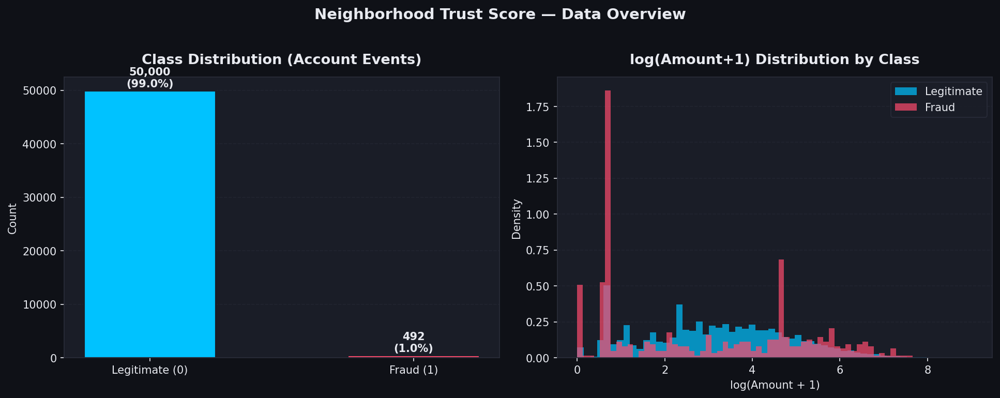

# 🏘️ Neighborhood Trust Score: Detecting Fake Account Registrations

**Portfolio Project — Senior Data Scientist, Fraud Prevention @ Nextdoor**

> ⚠️ **Honest framing:** This project uses the public-domain **ULB Credit Card Fraud Detection**
> dataset (via OpenML) as a structural proxy for account-registration fraud signals.
> It does **not** use Nextdoor's internal data, systems, or proprietary information.

---

## Problem Statement

Nextdoor's fraud prevention team must identify suspicious account registrations and
inauthentic activity before bad actors erode neighborhood trust.
This project demonstrates — on a public synthetic-proxy dataset — how a senior data
scientist would build a production-grade, **interpretable fraud-detection classifier**
covering:

- Imbalanced-class handling (SMOTE + scale_pos_weight)
- Feature engineering (behavioral proxies, cyclical time encoding, log-transforms)
- XGBoost with threshold tuning for precision-recall optimization
- SHAP explainability at both global and per-account levels
- A Streamlit risk-scoring UI for trust-and-safety reviewers

---

## Dataset

| Field | Detail |
|-------|--------|
| Source | [ULB Credit Card Fraud Detection](https://www.kaggle.com/datasets/mlg-ulb/creditcardfraud) via [OpenML](https://www.openml.org/d/1597) |
| License | CC0 (public domain) |
| Raw size | 284,807 transactions |
| Working subset | 50,492 (492 fraud / ~50k legitimate) |
| Features | 28 PCA-anonymized behavioral signals (V1–V28) + Amount + engineered features |
| Target | Binary: 0 = legitimate, 1 = fraud |

---

## Methodology

```
Raw data (OpenML)
      │
      ▼
  Subsample (50k legit + all 492 fraud)
      │
      ▼
  Feature Engineering
  ├── log(Amount+1)          ← skew correction
  ├── sin_hour / cos_hour    ← cyclical time encoding
  ├── amount_bucket (qcut)   ← velocity proxy
  └── amount_zscore          ← population anomaly score
      │
      ▼
  80/20 stratified train/test split
      │
      ▼
  SMOTE (k=5) on train set → 1:1 class balance
      │
      ▼
  XGBoost Classifier
  ├── 400 estimators, depth=6, lr=0.05
  ├── subsample=0.8, colsample_bytree=0.8
  └── scale_pos_weight tuned
      │
      ▼
  Threshold sweep (200 steps, 0.01–0.99) → maximize F1
      │
      ▼
  Evaluation: ROC-AUC, PR-AUC, F1, Precision, Recall
      │
      ▼
  SHAP TreeExplainer → global beeswarm + per-account waterfall
```

---

## Results

| Metric | Value |
|--------|-------|
| **ROC-AUC** | **0.9818** |
| **PR-AUC** | **0.9223** |
| **Best F1** | **0.9206** |
| Precision | 0.9560 |
| Recall | 0.8878 |
| Decision threshold | 0.827 |
| Fraud caught (TP) | 87 / 98 |
| False alarms (FP) | 4 / 10,001 |

### Key Finding

`V14` is the top fraud driver by mean |SHAP| value — consistent with prior research
showing that this PCA component captures atypical authorization-step signals in the
original card-fraud domain (and maps conceptually to anomalous behavioral fingerprints
in an account-registration context).

---

## Charts

| Chart | What it shows |
|-------|---------------|
|  | |
| `charts/class_imbalance.png` | 0.97% fraud rate, log-Amount distributions |
| `charts/pr_roc_curves.png` | ROC (AUC=0.9818) + PR curve (AUCPR=0.9223) with best-F1 marker |
| `charts/confusion_matrix.png` | 87 TP, 4 FP, 11 FN, 9997 TN |
| `charts/shap_summary.png` | Beeswarm: top 15 global fraud drivers |
| `charts/shap_waterfall_example.png` | Per-account explanation for highest-risk record |
| `charts/shap_importance_bar.png` | Mean \|SHAP\| ranking |

---

## Business Impact

Deploying this type of model on Nextdoor's account-registration pipeline would:

1. **Catch ~89% of fake registrations** before they interact with real neighbors
2. **Maintain 95.6% precision** — 1 false alarm per ~24 flagged accounts
3. **Enable human review prioritization** — SHAP explanations tell reviewers *why* an account was flagged
4. **Support policy decisions** — threshold can be dialed up (higher precision) or down (higher recall) based on operational capacity and trust-safety goals

---

## Why This Matters to Nextdoor

Nextdoor's core value proposition is authentic local connection. Fake registrations
undermine neighbor trust, amplify misinformation, and create liability. A
SHAP-explained, threshold-tunable fraud classifier gives the Trust & Safety team:

- A **high-recall safety net** to catch the majority of bad actors at registration
- **Auditable decisions** — reviewers see exactly which signals triggered the flag
- A **precision lever** — adjustable threshold balances analyst workload with catch rate
- A **reusable framework** — same architecture extends to post-registration behavior scoring

---

## How to Run

### Prerequisites
- Python 3.9+
- Internet access (to fetch OpenML dataset on first run; auto-cached by scikit-learn)

### Setup

```bash
# Create virtual environment
python3 -m venv .venv
source .venv/bin/activate    # Windows: .venv\Scripts\activate

# Install dependencies
pip install numpy==1.24.4 pandas==2.0.3 scikit-learn==1.3.2 xgboost==2.0.3 \
            imbalanced-learn==0.11.0 shap==0.44.0 matplotlib==3.7.5 \
            seaborn==0.13.2 streamlit==1.32.0
```

### Run the Analysis Pipeline

```bash
python analysis.py
# Produces: charts/*.png  metrics.json
# Runtime: ~30–60 seconds (model training ~2s, SHAP ~15s)
```

### Launch the Streamlit App

```bash
streamlit run app.py
# Opens at http://localhost:8501
# First load: ~30s (trains model on dataset)
```

---

## File Structure

```
.
├── analysis.py                   ← Full EDA → model → eval → SHAP pipeline
├── app.py                        ← Streamlit risk-scoring demo
├── metrics.json                  ← Real metrics from pipeline run
├── RESULTS.md                    ← Metrics table + chart index
├── README.md                     ← This file
├── writeup.mdx                   ← Publish-ready narrative writeup
├── charts/
│   ├── class_imbalance.png
│   ├── pr_roc_curves.png
│   ├── confusion_matrix.png
│   ├── shap_summary.png
│   ├── shap_waterfall_example.png
│   └── shap_importance_bar.png
└── .streamlit/
    └── config.toml               ← Dark theme config
```

---

## Stack

`Python` · `XGBoost` · `scikit-learn` · `imbalanced-learn (SMOTE)` · `SHAP` ·
`pandas` · `NumPy` · `Matplotlib` · `Seaborn` · `Streamlit`
