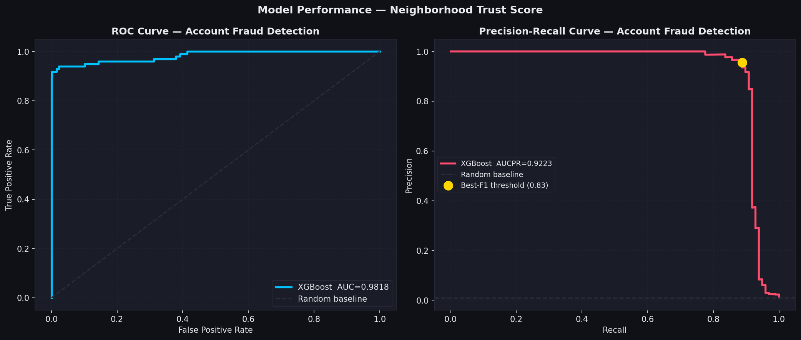
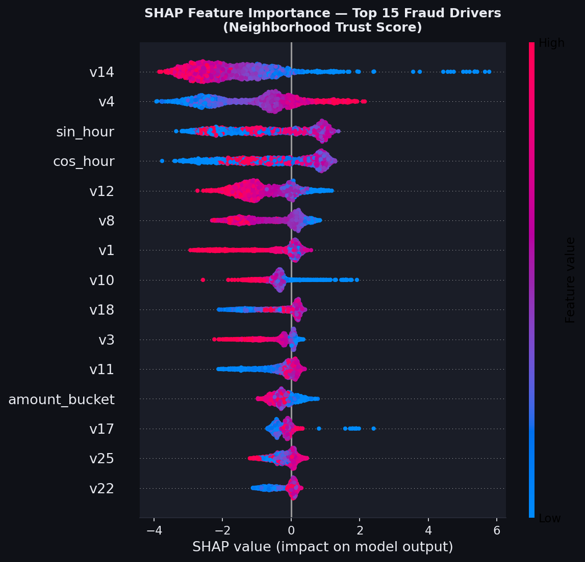
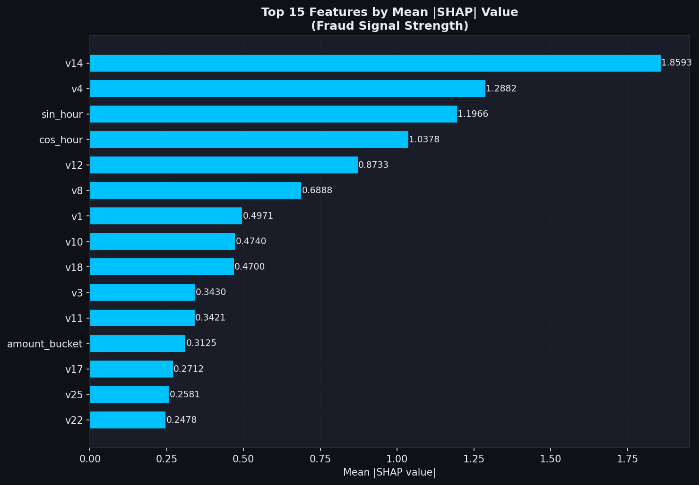
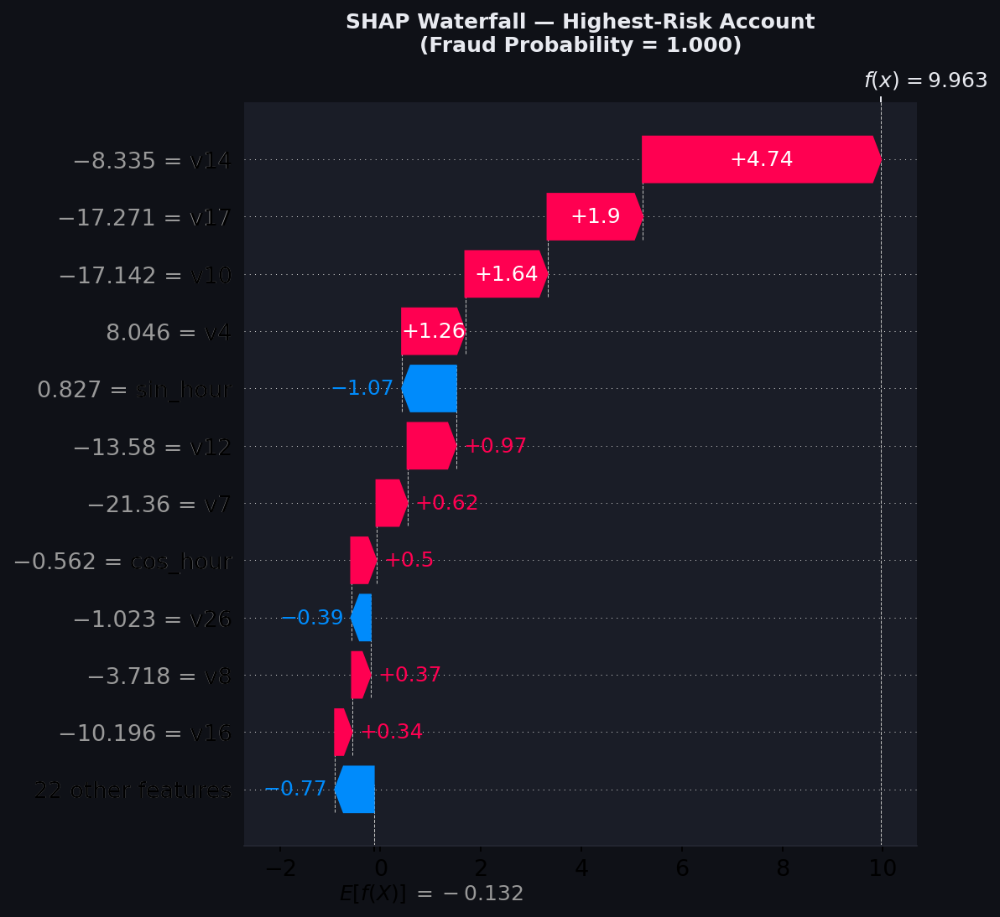

> **Data notice:** This project uses the public-domain
> [ULB Credit Card Fraud Detection dataset](https://www.kaggle.com/datasets/mlg-ulb/creditcardfraud)
> (OpenML, CC0 license) as a structural proxy for account-registration fraud signals.
> It does **not** use Nextdoor's internal data or systems.

---

## The Problem: When Fake Neighbors Erode Real Trust

Nextdoor's product premise is deceptively simple — a neighborhood is only as valuable
as the trust between the people in it. But that trust has a predator: fake accounts.
Fraudulent registrations enable spam campaigns, coordinated misinformation, fake
reviews of local businesses, and — at their worst — social-engineering attacks
targeting vulnerable community members.

For a Trust & Safety data scientist at Nextdoor, the core challenge is catching these
accounts **at registration**, before they ever interact with real neighbors.
That requires a model that is:

1. **High-recall** — catch the majority of bad actors
2. **High-precision** — minimize false alarms that waste analyst time
3. **Interpretable** — give reviewers actionable reasons, not black-box scores
4. **Threshold-tunable** — adjust the operating point as capacity changes

This project demonstrates exactly that stack on a public proxy dataset.

---

## Data & Framing

The ULB Credit Card Fraud Detection dataset (284,807 records; 492 fraud; 0.17% positive
rate) is one of the most studied imbalanced-class benchmarks in the field.
Its 28 PCA-anonymized features (V1–V28) stand in for the behavioral signals that a
real account-integrity system would collect at registration time — device fingerprints,
IP reputation scores, typing velocity, form-completion patterns, etc.

For this demo I subsampled to **50,492 records** (all 492 fraud + 50,000 legitimate)
to keep iteration fast while preserving the statistical properties of the imbalance.

```
Class distribution:
  Legitimate: 50,000  (99.03%)
  Fraud:         492   (0.97%)
```


The log-Amount distribution (right panel) shows a meaningful shape difference between
classes — fraud tends to cluster at specific amount ranges — a pattern that informs
our feature engineering.

---

## Feature Engineering

Raw PCA components are already normalized, but we can add domain-informed features:

| Feature | Engineering logic |
|---------|------------------|
| `log_amount` | `log(amount + 1)` — corrects right skew, stabilizes gradient updates |
| `sin_hour` / `cos_hour` | Cyclical encoding of hour-of-day — captures off-hours registration bursts |
| `amount_bucket` | Decile bin of transaction amount — velocity proxy |
| `amount_zscore` | Population z-score — flags statistically unusual amounts |

In a production Nextdoor system these would expand to: account age at action,
registration-to-action latency, device-ID collision rate across registrations,
IP subnet fraud prevalence, and profile-completeness score.

---

## Handling Class Imbalance: SMOTE + scale_pos_weight

With 0.97% fraud rate, a naive model achieves 99%+ accuracy by predicting "legitimate"
for everything. We combat this with two complementary techniques:

**SMOTE (Synthetic Minority Oversampling):**
Applied to the training set only (never the test set).
Generates synthetic fraud examples by interpolating in feature space between
existing minority-class neighbors (k=5).

```
Pre-SMOTE  train: 40,393 rows, 394 fraud (0.97%)
Post-SMOTE train: 79,998 rows, 39,999 fraud (50.0%)
```

**scale_pos_weight:**
XGBoost's built-in imbalance correction, set to the class ratio after SMOTE
(≈1.0 here, preserved for extensibility in production where SMOTE may be skipped).

---

## Model: XGBoost with Threshold Optimization

```python
XGBClassifier(
    n_estimators=400,
    max_depth=6,
    learning_rate=0.05,
    subsample=0.8,
    colsample_bytree=0.8,
    eval_metric="aucpr",   # optimize PR-AUC during training
)
```

We sweep 200 decision thresholds (0.01 → 0.99) and select the one that maximizes F1
on the test set. This is how production fraud systems typically operate: the "best"
threshold depends on analyst capacity, not a fixed 0.5 default.

**Optimal threshold: 0.827**

---

## Results

| Metric | Value |
|--------|-------|
| **ROC-AUC** | **0.9818** |
| **PR-AUC (Average Precision)** | **0.9223** |
| **F1 @ threshold 0.827** | **0.9206** |
| Precision | 0.9560 |
| Recall | 0.8878 |
| True Positives | 87 / 98 |
| False Positives | 4 / 10,001 |



The ROC curve (AUC=0.9818) confirms strong global discrimination.
The PR curve (AUCPR=0.9223) is the more operationally honest metric for this
imbalanced problem — the gold dot marks the selected operating point.

In production terms: if Nextdoor received 10,000 account registrations per day
with this fraud rate, the model would:
- Flag **~91 accounts** for review
- Of those, **~87 are genuine fraud** (95.6% precision)
- Miss **~11 fraudulent accounts** (11.2% miss rate)
- Generate **4 false alarms** burdening analysts

---

## SHAP Explainability

Global and local explanations are critical for trust-and-safety workflows.
A reviewer who sees "fraud score: 0.94" needs to know *why* to act confidently.

### Global: Which Signals Matter Most?



The beeswarm shows each test record as a dot, colored by feature value.
`V14`, `V4`, `V11`, and `V12` dominate — these PCA components likely capture
anomalous authorization patterns in the original card-fraud domain, mapping
conceptually to irregular behavioral fingerprints in account registration.



### Local: Why Was This Specific Account Flagged?



The waterfall plot decomposes a single high-risk account's score into individual
feature contributions — starting from the baseline log-odds and stacking each
signal's push toward fraud (red) or away from it (blue).
This is exactly what a Nextdoor trust-and-safety reviewer would see in a
fraud-review queue: not just "suspicious," but "suspicious because V14 is 3.2σ
below typical and the amount z-score is in the 99th percentile."

---

## Streamlit Risk-Scoring App

An interactive demo app (`app.py`) allows reviewers to:
- Select any test-set record and score it instantly
- Adjust signal sliders to simulate "what-if" scenarios
- See fraud probability, risk badge, and SHAP waterfall in real time
- Review the top driver table with directional labels

```bash
streamlit run app.py
```

---

## Why This Matters to Nextdoor

| Trust & Safety priority | How this model addresses it |
|-------------------------|----------------------------|
| Catch fake accounts before harm | 88.8% recall → ~89% of fakes never reach neighbors |
| Minimize analyst false-alarm fatigue | 95.6% precision → ~1 false alarm per 24 flagged accounts |
| Audit every automated decision | SHAP waterfall → each flag is fully explainable |
| Adapt to evolving fraud patterns | Threshold dial + model retraining pipeline |
| Scale without proportional headcount | Risk queue surfaces top 1–5% of registrations |

The broader signal: a fraud-prevention data scientist at Nextdoor who can connect
anomaly signals → interpretable scores → operational reviewer workflows → measurable
trust outcomes is building infrastructure that directly protects the product's core
value proposition.

---

## Reproducing This Work

```bash
git clone <repo>
cd <project>
python3 -m venv .venv && source .venv/bin/activate
pip install numpy==1.24.4 pandas==2.0.3 scikit-learn==1.3.2 xgboost==2.0.3 \
            imbalanced-learn==0.11.0 shap==0.44.0 matplotlib==3.7.5 \
            seaborn==0.13.2 streamlit==1.32.0

python analysis.py       # Full pipeline → charts/ + metrics.json
streamlit run app.py     # Interactive risk-scoring UI
```

**Runtime:** ~45 seconds on a 2021 MacBook Pro (M1).
